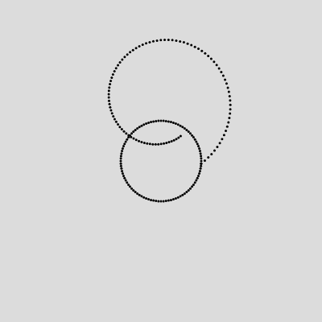

# Pitaya 4.0

A tiny language for drawing particular drawings.

## Getting Started
To use Pitaya, you'll need to have the following installed:

* Node 22.12.0 or above
* NPM 10.9.0 or above

Then, at the root of this project, run `npm i` to install all dependencies.

## Minimal Example
Pitaya is a kind of L-System that plots points in space, and then draws arcs around those points. If that seems vague, then read along! 

Here's one of the simplest non-trivial Pitaya programs. Write the following in a file called `circle.pta`.

```
node c = [rot=1; rad=50].
path = c.
```

We name a `node` `c`. Pitaya will aim to draw a circle around this node. `rot` tells Pitaya how many rotations around the center we want it to go for, and `rad` tells the intended radius of that circle. To draw the circle, we attach the node to a path by writing `path = c`.

Now, run the following command at the root of the project, run the command

```
node index -f <path-to-your-file> -i ./interpreters/dots.js
```

Doing that will result in new files appearing under the `output` folder in this project. Open `output/index.html` in your browser. You should see the following image:


This is your first Pitaya drawing! Pitaya plotted an arc that rotates around the center exactly once at a radius of 50 pixels.

## Example 2
Now, I promised this was sort of an L-System. Let's prove it by drawing with direction. This example will draw two arcs whose centers are linked via an (invisible) edge.

We extend our previous example by adding an edge and an extra node like so:

```
node c = [rot=-1; rad=50].
path = c ->[len=75; theta=-90] c.
```

Note that we also changed the value of `rot` to `-1` rather than `1`. Negative values for `rot` will make the arc draw counter-clockwise. As for the edge we just added, `len` determines the length of the edge in pixels, and `theta` determines the angle of the edge. In this case, the center of the second `c` will be 75 pixels directly above the first.

Once again, run the command

```
node index -f <path-to-your-file> -i ./interpreters/dots.js
```

The result should look like the following image:



## Example 3
Let's keep editing the same file. This time, we'll differentiate the two nodes on our
edge so that we can independently manipulate the parameters on them. 

```
node c0 = [rot=1; rad=50].
node c1 = [rot=-2; rad=10].
path = c0 ->[len=75; theta=-90] c1.
```

Specifically, we change the `rot` and `rad` on the second node (`c1`). Doing this will
cause the second arc to "swirl" more toward a smaller radius. When drawing an arc around a node, Pitaya corrects the radius that it's drawing with gradually until getting to the intended radius denoted by `rad`. In this case, because the second circle starts from the tangent of the first circle, the radius Pitaya is drawing with is larger than the intended radius, so Pitaya gradually decreases the radius. It may never get to `10`, but it'll try.

Running the program and inspecting the browser should show this image:


## Example 4
For our last example, we introduce two more parameters for nodes: `thetaStep` and `radiusStep`. The former changes the distance between the points drawn. The latter changes how quickly Pitaya corrects the radius. We want to keep these numbers between 0 and 1. Play around with these values to get a sense for how they affect the drawing.

For now, try the following code:

```
node c0 = [rot=1; rad=50].
node c1 = [rot=-2; rad=10 ; thetaStep = 0.001 ; radiusStep = 0.001].
path = c0 ->[len=75; theta=-90] c1.
```

That should result in the following drawing. Note how the second arc is thicker than in the previous drawing.


## One Complex Example
Here's just one more example to show off what Pitaya can do!

Here's the code:
```
node n0 = [rot = 1 ; rad = 0].
node n1 = [rot = 50 ; rad = 1 ; thetaStep = 0.0001 ; radiusStep = 0.0005].
node n2 = [rot = -50 ; rad = 1 ; thetaStep = 0.0001 ; radiusStep = 0.0005].
path = n0 
        ->[len=100 ; theta = 30] n1 
        ->[len=100 ; theta = -90] n1.
path = n0 
  ->[len=100 ; theta = 210] n2 
  ->[len=100 ; theta = -90] n2.
```

And here's the result:


---

## About Interpreters

To write
